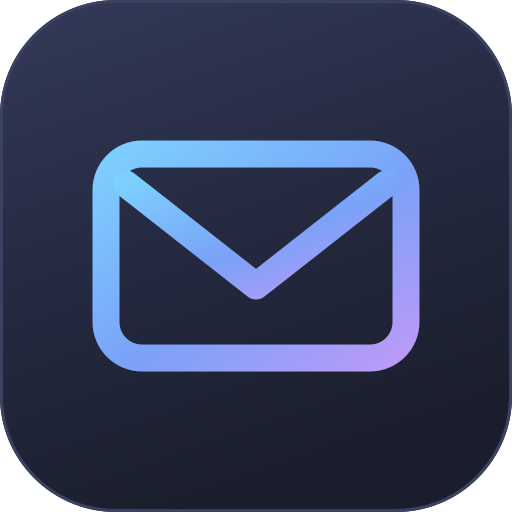

<div align="center">



# MailKib

**A fast, keyboard-first desktop mail client for Linux.**
Superhuman-shaped, dressed in Tokyo Night — and sixteen other themes, light ones included.

</div>

Gmail and Microsoft accounts, connected with **your own** OAuth credentials. There is no
MailKib server, no shared API key, and nothing proxied through a third party: the app talks
straight from your machine to Google or Microsoft.

---

## Getting it onto a machine

Two paths. Both end with MailKib in your application launcher.

### A. Download the AppImage

Go to the [Releases page](https://github.com/marcid34/mailkib/releases), grab
`MailKib-0.6.0-x86_64.AppImage`, then:

```bash
mkdir -p ~/Applications
mv ~/Downloads/MailKib-0.6.0-x86_64.AppImage ~/Applications/MailKib.AppImage
chmod +x ~/Applications/MailKib.AppImage
~/Applications/MailKib.AppImage
```

On first launch MailKib registers itself in the XDG application menu — it writes
`~/.local/share/applications/mailkib.desktop` pointing at wherever the AppImage lives and
drops the icon into `~/.local/share/icons/hicolor/`. **rofi, wofi, GNOME and KDE read it
from there**, so from then on you just type `MailKib` in rofi.

Keep the AppImage somewhere stable — the menu entry records its path. If you move it, run it
once from the new location, or use *Settings → Application menu entry → Reinstall*.

An AppImage needs FUSE. On Arch that is already there via `fuse2`/`fuse3`; if you get
`dlopen(): error loading libfuse.so.2`, either `sudo pacman -S fuse2` or run it with
`--appimage-extract-and-run`.

### B. Build it from source

On a clean Arch box:

```bash
sudo pacman -S --needed git nodejs npm

git clone https://github.com/marcid34/mailkib.git
cd mailkib
npm install

# npm 12 blocks package install scripts by default, which skips Electron's
# binary download. If node_modules/electron/dist/ is missing, run:
node node_modules/electron/install.js

npm run dist          # -> release/MailKib-0.6.0-x86_64.AppImage
```

Then install it as in **A**, pointing at `release/MailKib-0.6.0-x86_64.AppImage`.

`npm run dist:all` also produces `.pacman` and `.deb` packages. Those register their desktop
entry through the package manager, so the self-registration step is skipped:

```bash
npm run dist:all
sudo pacman -U release/MailKib-0.2.5-x86_64.pacman
```

The build downloads Electron (~120 MB) the first time, so the machine needs internet for the
build itself — but not for anything else.

### Development

```bash
npm run dev        # hot-reloading Electron
npm run typecheck
npm run build
```

---

## Does this need a server?

**No.** MailKib makes outbound HTTPS requests to `gmail.googleapis.com` (or
`graph.microsoft.com`) and nothing else. It never listens for inbound connections, so there
is no port to open, no firewall rule, no NAT or port-forwarding to arrange. It works on any
network that can reach those hosts — home, café, tethered phone.

The single exception is the OAuth handshake: while you are authorising, MailKib binds a
random high port on the loopback interface (`127.0.0.1`/`::1`) to catch Google's redirect. It
rejects any request whose source is not loopback, and closes within seconds of receiving the
code. Nothing outside your machine can reach it, even briefly.

---

## First run on a new machine

Your local login and your saved tokens are **per machine** — the vault is encrypted with a
key that never leaves the device. So on a second laptop you will:

1. **Create a local account** (username + password). This unlocks this copy of MailKib and
   nothing else; it is not an email account and it is never sent anywhere. The session
   persists across restarts until you explicitly sign out.
2. **Re-enter the same OAuth client ID and secret** you created in Google Cloud. The
   credential belongs to your Google Cloud *project*, not to a device or an IP, so the exact
   same pair works on any machine and any network. Keep it in your password manager.
3. **Authorise in the browser** and you are back in.

You do **not** need to create a new Google Cloud project, and you do **not** need to change
anything because you are on a different network.

### Getting Gmail credentials (once, ever)

1. Create a project in the [Google Cloud Console](https://console.cloud.google.com/projectcreate).
2. Enable the [Gmail API](https://console.cloud.google.com/apis/library/gmail.googleapis.com).
3. Go to **Google Auth Platform → [Audience](https://console.cloud.google.com/auth/audience)**.
   Set the user type to *External* and leave the publishing status on **Testing**.
4. On that same page, under **Test users**, add the Gmail address you are connecting.
5. Under **Clients**, create an *OAuth client ID* of type **Desktop app**.
6. Paste the client ID and client secret into MailKib.
7. When your browser warns "Google hasn't verified this app", click **Advanced** →
   **Go to MailKib (unsafe)**.

MailKib requests a single scope: `https://www.googleapis.com/auth/gmail.modify` — read,
send, label and trash, but never permanent deletion.

> **Do not click "Publish app".** Gmail scopes are *restricted*, Google's most sensitive
> tier. An unverified app in production is blocked outright with
> *"Access blocked: MailKib has not completed the Google verification process"*. Staying in
> **Testing** with yourself as a test user is the correct setup for a personal client.

#### The 7-day reconnect

The cost of staying in Testing is that Google expires the refresh token after 7 days, so
MailKib will ask you to reconnect roughly weekly. There is no way around this short of
formal verification, which for restricted scopes means a 4–12 week review plus a paid CASA
Tier 2 security assessment — not sensible for a personal mail client.

Two escape hatches, if the weekly reconnect grates:

- **Google Workspace account.** If the address is on a Workspace domain you administer, set
  the user type to *Internal* instead. Internal apps need no verification and issue
  non-expiring refresh tokens.
- **IMAP + an app password**, which sidesteps OAuth verification entirely. Not implemented
  yet — see *Not yet* below.

#### Troubleshooting

| Symptom | Cause |
|---|---|
| "Access blocked: MailKib has not completed the Google verification process" | App is published to production, or your address is missing from *Test users* |
| "Google hasn't verified this app" | Expected. Click *Advanced* → *Go to MailKib (unsafe)* |
| Worked, then stopped after a week | Testing-status refresh token expired; reconnect |
| "Google did not return a refresh token" | Revoke MailKib at [myaccount.google.com/permissions](https://myaccount.google.com/permissions) and connect again |
| Nothing happens after the consent screen | The loopback callback was blocked. Check that no VPN/proxy is intercepting `127.0.0.1` |

### Getting Microsoft credentials

1. Register an app in [Entra / App registrations](https://entra.microsoft.com/#view/Microsoft_AAD_RegisteredApps/ApplicationsListBlade).
2. Account types: *Accounts in any organizational directory and personal Microsoft accounts*.
3. Add a platform → **Mobile and desktop applications** → redirect URI `http://localhost`.
4. API permissions → Microsoft Graph → delegated: `Mail.ReadWrite`, `Mail.Send`,
   `User.Read`, `offline_access`.
5. Paste the Application (client) ID. No secret needed — it authenticates as a public
   client with PKCE.

---

## Keyboard

MailKib is built to be driven without the mouse.

| | |
|---|---|
| `j` / `k` | next / previous conversation |
| `↵` or `o` | open |
| `u` or `esc` | back to the list |
| `e` | archive |
| `#` | delete |
| `s` | star / unstar |
| `shift+u` | mark unread |
| `shift+i` | move to inbox |
| `x` | tick this conversation |
| `shift+j` / `shift+k` | extend the selection |
| `ctrl+a` | select everything listed |
| `esc` | clear the selection |
| `c` | compose |
| `r` / `a` / `f` | reply / reply all / forward |
| `ctrl+↵` | send |
| `ctrl+shift+a` | attach files (in compose) |
| `ctrl+0` | the hub |
| `ctrl+1`…`ctrl+5` | jump to a module |
| `ctrl+\` | toggle the notes panel |
| `/` | search |
| `ctrl+k` | command palette |
| `ctrl+r` | refresh |
| `g` then `i s t d a e x` | inbox, starred, sent, drafts, all mail, archive, trash |
| `g` then `c` | address book |
| `?` | shortcut cheatsheet |

In the composer, `ctrl+b` / `ctrl+i` / `ctrl+e` wrap the selection in bold, italic or code
when writing Markdown.

## Mouse

Right-click does what you would expect:

- **A conversation** — reply, archive, delete, star, mark read/unread, *Move to* or
  *Apply label* (your labels in a submenu), copy the sender or subject.
- **Empty space in the sidebar** — create a label/folder.
- **A label** — open, create a sub-label, rename, or delete it.

**Drag a conversation onto a label** to file it. Inbox, Starred, Archive and Trash are drop
targets too, and the sidebar highlights what will accept the drop while you drag.

## Selecting several at once

Every row has a tick box that appears when you hover it.

- **shift+click** sweeps a range from wherever the cursor is to the row you clicked. Clicking
  again with shift *redraws* that sweep, so you can pull it back in as well as push it out.
- **ctrl+click** (or the tick box) adds and removes one row at a time, and the row it lands on
  becomes the anchor for the next shift+click.
- The bar above the list says how many are ticked and carries the actions: mark read, mark
  unread, star, archive, delete. `e`, `#` and `s` do the same from the keyboard, and archiving
  a batch is undoable from the toast.
- **Dragging any ticked row** drags the whole selection onto a label.

Selections span mailboxes — in an all-mailbox search, a batch is grouped per account and each
provider is asked once.

---

## Notifications and counts

New mail is visible from wherever you are standing, not only from the folder it landed in.

- Every connected mailbox is polled on a short interval, not just the one on screen.
- **Unread counts** sit on each folder, each label, and each account chip — the account chips
  in the account's own colour, so with several mailboxes you can tell which one woke up
  without reading a word. The mail button in the rail carries the total across all of them.
- **Desktop notifications** when mail arrives while the app is running. Clicking one brings
  the window forward and opens that conversation, whichever module you were in. A burst of
  more than three collapses into a single summary.
- **A launcher badge** with the unread total, where the desktop supports one.

All three are switchable in *Settings → Notifications*. Mail that was already sitting unread
when you launched the app is counted but never announced.

## Themes

Seventeen themes — fourteen dark, three light — switched instantly from **Settings → Theme**.
The choice is remembered across restarts and applies to the message viewer as well as the app
chrome.

| Family | Themes |
|---|---|
| Tokyo Night | Storm *(default)*, Night |
| Catppuccin | Mocha, Macchiato, Frappé, Latte *(light)* |
| Woodland | Everforest, Kanagawa |
| Ayu | Mirage |
| Atom | One Dark |
| Retro | Gruvbox, Solarized, Solarized Light *(light)* |
| Arctic | Nord |
| Classic | Dracula, Rosé Pine, Dawn *(light)* |

Each theme names two accents rather than one: a primary and a counterweight across the wheel
from it. The primary marks where you are, the counterweight marks what is new — unread dots,
count bubbles, the selection. Every tint the UI uses (soft fills, focus lines, glows) is
derived from the live palette at runtime, so a theme is never a dark blue app wearing a
different coat.

Every colour in the UI comes from a CSS custom property, so adding another theme is one
object in `src/renderer/src/lib/themes.ts`.

## Offline cache

Message lists, opened threads and your contacts are mirrored locally, encrypted with the
same device key as your tokens. Switching folders or reopening a thread paints from the
cache immediately, then the network result replaces it — so the UI never sits blank waiting
on a round trip. Searching answers from the cache first, too, then refines with the server's
results.

The cache is capped (6 000 message summaries, 250 threads) and pruned by recency. *Settings →
Offline cache* shows what is held and clears it. Mail bodies beyond the cached threads are
never written to disk.

## Address book

Contacts are learned automatically from the mail you read and send — no extra OAuth scope,
no Google Contacts permission. Every sync and every thread you open feeds it. People you
write to rank above people who merely write to you, then by frequency, then recency.

- **Address book** in the sidebar footer, *Settings → Address book → Manage*, `g` then `c`,
  or the command palette. Searchable; `↵` composes to whoever is selected.
- **To / Cc / Bcc autocomplete** as you type, including after a comma. `↵` or `tab` accepts.

Because contacts are learned, they need managing. Right-click anyone in the address book, or
use the button on their row:

- **Hide from suggestions** — keeps them out of autocomplete permanently. This is the one you
  want for an address that keeps surfacing: it survives re-learning, so the next sync will not
  bring it back.
- **Rename** — a local display name, for senders whose own name is unhelpful.
- **Forget** — deletes the record entirely. Honest warning: it comes back if they appear in
  your mail again. Hide, don't forget, if you want it gone for good.

Hidden contacts stay visible in the address book, greyed out and tagged, so you can restore
them.

## Writing

Three composer modes, switched from the toolbar:

- **Markdown** (default) — GFM: headings, lists, tables, code fences, quotes, links. It is
  rendered to HTML on send, and the styling that email clients care about is written onto the
  elements themselves, since many of them drop `<style>` blocks. The Markdown source is sent
  as the `text/plain` alternative, which reads fine on its own.
- **HTML** — raw HTML and `<style>` go out exactly as written, CSS included.
- **Plain** — sent as typed.

The preview (eye icon) renders on white, because that is what your recipient will most likely
be looking at. It is deliberately *not* sanitised, so what you see is what gets sent.

## Folders, archiving and search

**Archiving** removes only the `INBOX` label from the conversation — the same operation
Gmail's own archive performs. Nothing is deleted and every other label is kept.

- **All Mail** is everything except Spam and Trash, exactly like Gmail's. Anything you ever
  archived lives here.
- **Archive** is the narrower view of mail filed away from the inbox
  (`-in:inbox -in:sent -in:draft`). Both are computed by Gmail, so they include mail archived
  long before MailKib existed.

**Search is global by default.** Typing in the search box searches every message regardless
of the folder you are standing in — archived mail included — which is what Gmail's search box
does. A scope control appears above the field so you can restrict it back to the current
folder.

Terms are ANDed, quotes hold a phrase together, and Gmail's operators work as usual:
`from:`, `to:`, `subject:`, `label:`, `has:attachment`, `is:unread`, `before:`/`after:`.

As you type, MailKib parses the query into chips underneath the field — click one to drop
that term. It offers refinements for the word you are on (search anywhere, `from:`,
`subject:`, or one of your labels), and matched terms are highlighted in the result rows.

---

## Where your data lives

Everything is local, under `~/.config/MailKib/`:

| File | Contents |
|---|---|
| `users.json` | local usernames, scrypt password hashes (N=2¹⁵), and the current session |
| `vault-<user>.enc` | OAuth client IDs, secrets and tokens — AES-256-GCM |
| `cache-<account>.enc` | cached message summaries, threads and contacts — AES-256-GCM |
| `device.key.enc` / `device.key` | the vault key |
| `settings.json` | theme choice and cache toggle |
| `window.json` | window geometry |

The vault key is stored in your OS keyring via Electron's `safeStorage` when a real backend
(gnome-keyring, kwallet) is available. On a bare window manager with no keyring, Electron
falls back to a plaintext backend — MailKib detects that and writes a `0600` key file
instead, rather than pretending the keyring protected anything. Settings shows which is in
use.

Nothing is synced anywhere. Moving to a new machine means re-entering your OAuth client
credentials, by design.

## How messages are rendered

Message HTML is sanitised with DOMPurify and rendered in an iframe that has no script
permission and its own restrictive CSP. Inline `cid:` images that arrived with the message
are embedded directly. Links open in your system browser rather than inside the app.

**Background.** HTML email is written for a white page: senders set their own dark text and
leave the background to the client. Rendering that on a dark surface gives you dark-on-dark
text and patchwork white blocks wherever the sender *did* set one. So *Settings → Reading →
Message background* offers:

- **Auto** (default) — messages that carry their own design (tables, `<style>`, background
  colours, images) get a real white sheet; plain replies stay on your theme, where they look
  native.
- **Light** — every message on a white sheet.
- **Dark** — every message on your theme. Expect some senders to look wrong.

Messages laid out wider than the reading pane — newsletters are usually built at 600px — are
scaled down to fit rather than given a horizontal scrollbar.

**Remote images.** *Settings → Reading → Remote images* is **Always** by default, because
blocked images make most mail look broken. Set it to **Ask** to get a per-message "Show
images" bar instead, or **Never**. Loading remote images tells the sender you opened the
message; that is how tracking pixels work.

---

## The hub

Kib opens on a hub: **Mail**, **Notes**, and three doors — Vault, Health, Planner — that are
drawn but not built. Mail and Notes are real. A rail down the left switches between them
without going back to the hub, `ctrl+1`…`ctrl+5` does the same from the keyboard, and `ctrl+0`
returns to the front door.

Mail is no longer required: you can use Kib for notes alone and never connect a mailbox.

## Notes

Notes are per-user, encrypted at rest with the same device key as the mail cache, and stored
as an index plus one file per body — so typing rewrites one small file rather than everything
you have written. Three formats:

- **Plain** — shown exactly as typed.
- **Markdown** — rendered into the app's own theme rather than onto a white sheet.
- **HTML** — a whole little web page. CSS and JavaScript both run.

HTML notes open in a real code editor rather than a textarea: syntax highlighting that follows
whichever of the ten themes you are using, completion for tags, attributes and CSS properties,
auto-indent, tab to indent a line or a selection, and brackets and tags that close themselves.
The same editor backs **HTML compose** in mail, so a hand-written message gets the same
treatment — with the live preview beside it.

That last one is the interesting one. HTML notes are served from a `kibnote://` scheme with an
origin of their own, so a note runs its own scripts without inheriting or weakening the policy
that protects the window holding your mail tokens. The frame is sandboxed without
`allow-same-origin`, so a note cannot reach the app, and its own policy forbids every kind of
outbound connection — `fetch`, `XMLHttpRequest` and WebSocket are all refused. Images over
https are allowed, since the note is something you wrote.

`ctrl+\` opens a notes panel beside whatever else you are doing, including a mail thread.

## What works

Gmail (fully) and Microsoft Graph (same feature set, less field-tested). Multiple accounts,
labels and folders including nesting/create/rename/delete, threaded reading, search with
operators and highlighting, an offline cache, a learned address book with autocomplete,
Markdown/HTML/plain compose with live preview, attachments in and out (pick or drop files to
send, and a forward carries the original's files along), reply/reply-all/forward, star,
archive, trash, mark unread, drag-and-drop filing, context menus, attachment preview with
per-file preview and download buttons, undo for archive, a command palette, ten themes, and
the keyboard map above.

## Not yet

Local draft saving (compose is send-or-discard), inline images in the composer, a WYSIWYG
composer, and signatures. Notes have no sync, history or export yet, and cannot be linked to
a thread.

Vault, Health and Planner are hub tiles and nothing more. Vault in particular will need a
password-derived key and a real locked/unlocked session — the device key that protects mail
and notes is not enough for a password manager.

Also not yet: **IMAP/SMTP with an app password** as an alternative to OAuth. For a personal
client this is arguably the better transport — no Google verification, no test-user list, and
no 7-day token expiry — at the cost of an app password and losing Gmail's server-side search
and label semantics.

## Licence

MIT
